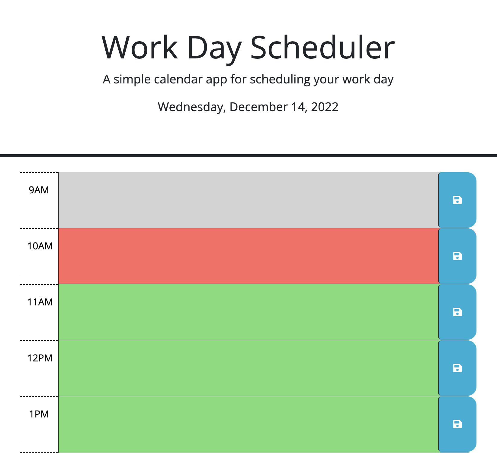
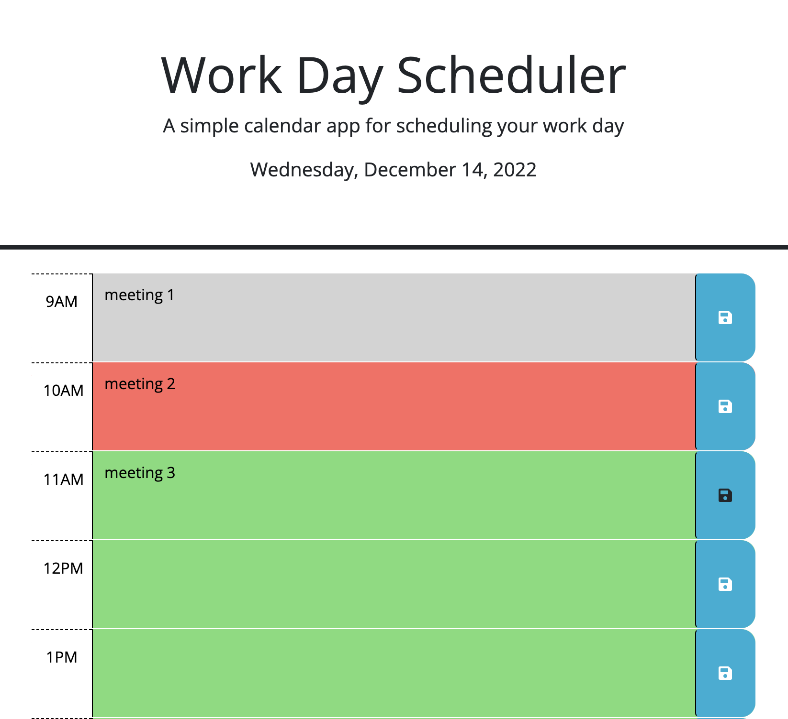

# Work-Day-Scheduler

## Description

This project is to create a simple interactive application that allows a user to save events for each hour of the day from 9 am to 5 pm. The user with a busy schedule can manage time effectively by adding important events to this application.

## Strategies

1. The user will see the time information of current day on the top of the page.
2. The user will see multiple time-blocks for standard business hours when scrolling down the page.
3. Each time block is color-coded to indicate whether it is in the past (grey), present (red), or future(green). The color will change dynamically based on the current time.
4. The user can enter event to each time block.
5. The event text can be saved to local storage when the user click on save button.
6. The saved events persist when the user refreshing the page.

## Application URL

https://lzh1990214.github.io/Work-Day-Scheduler/

## Screenshots

Home page displaying current time and allowing user to enter event in each time block:

Each event text is saved in local storage as value with associated hour as key:

